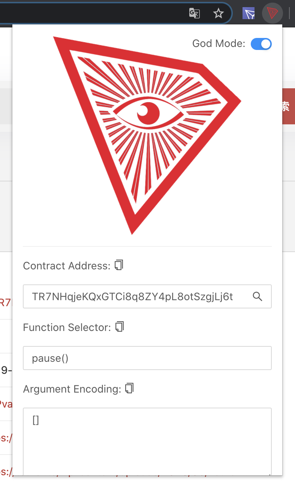

## TronGod

Get Tron smart contract params before signing the transaction.

## Build

Run `npm i && npm run build` to build the extension.

[Learn More](https://developer.chrome.com/extensions/getstarted)
